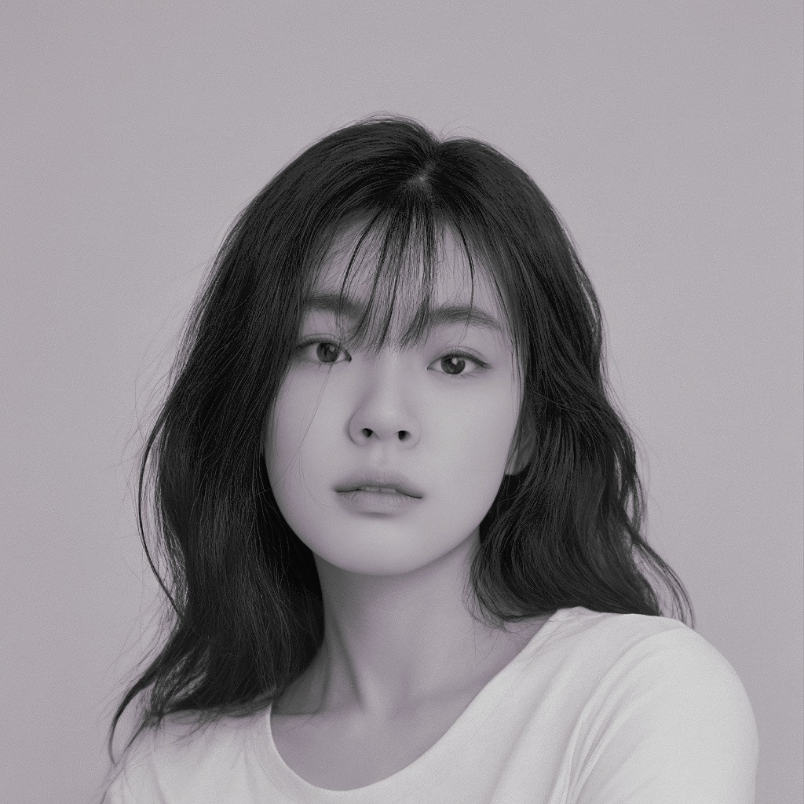

---
# Leave the homepage title empty to use the site title
title:
date: 2024-03-25
type: landing

sections:
  - block: markdown
    content:
      title:
      text: |
        About Me
        

          <!-- 왼쪽: 프로필 사진과 이름, 학교 정보 -->
          

            
            
류하영

            
전북대학교

          

          <!-- 오른쪽: 소개 정보 -->
          

            

              전공: IT지능정보공학과 
              안녕하세요, 전북대학교 IT지능정보공학과의 류하영입니다! 잘 부탁 드립니다 
              본 웹 사이트는 제 다양한 소개를 담은 사이트입니다. 제 전공 소개부터 다양한 제 관심사와 공부 분야에 대해서 이야기해 드립니다 
              관심 분야는 정보보안, 풀스택 개발입니다  
              <a href="./contact/" class="btn">Contact Me</a>
            

          

        

    design:
      columns: '1'
      background:
        image:
          filename: faraaz-zuberi-YoIq2GyYcAU-unsplash.jpg
          filters:
            brightness: 0.8
        overlay:  # 오버레이 추가
          color: '#ffffff'  # 흰색
          opacity: 0.5  # 투명도 조절

  - block: features
    content:
      title:  This web is my portfolio website 
      text:  제 포트폴리오 웹 사이트에 오신 것을 환영합니다!.   
        <a href="./post/" class="btn">See my posts</a>
      

  - block: slider
    content:
      slides:

        - title: Contact Me!
          content: hayoung's portfolio!
          align: center
          background:
            image:
              filename: luke-jones-tBvF46kmwBw-unsplash.jpg
              filters:
                brightness: 0.5
            overlay:  # 오버레이 추가
              color: '#0000ff'  # 흰색
              opacity: 0.5  # 투명도 조절
            position: center
            color: '#0000ff'
          link:
            icon: user
            icon_pack: fas
            text: contact
            text-color: '#000'
            url: contact

        - title: Mobile App Dev
          content: 다양한 디자인의 모바일 어플리케이션 제작
          align: center
          background:
            image:
              filename: luke-miller-7meutoti8Vw-unsplash.jpg
              filters:
                brightness: 1
            overlay:  # 오버레이 추가
              color: '#0000ff'  # 흰색
              opacity: 0.5  # 투명도 조절
            position: center
            color: '#0000ff'

        - title: Information Security
          content: 정보보호를 위한 웹사이트의 취약점 진단
          align: center
          background:
            image:
              filename: nastia-petruk-rZX6KxPw5pg-unsplash.jpg
              filters:
                brightness: 1
            position: center
            color: '#0000ff'

        - title: Hacking
          content: 적용 가능한 해킹 코드 개발
          align: center
          background:
            image:
              filename: philip-oroni-VfOGf5RWkeg-unsplash.jpg
              filters:
                brightness: 1.7
            position: center
            color: '#0000ff'

        - title: Development
          content: Full-Stack 웹 개발
          align: center
          background:
            image:
              filename: steve-johnson-KKDMyLTIyVs-unsplash.jpg
              filters:
                brightness: 1.7
            position: center
            color: '#0000ff'

    design:
      # Slide height is automatic unless you force a specific height (e.g. '400px')
      slide_height: '450px'
      slide_width: '90px'
      is_fullscreen: false
      # Automatically transition through slides?
      loop: true
      # Duration of transition between slides (in ms)
      interval: 5000

  - block: features
    id: features
    content:
      title: hayoung's Interests
      text: 저는 이런 분야에 관심을 두고 있어요.    
      items:
        - name: 웹 보안
          icon: key
          icon_pack: fas
          description: 공부했던 웹을 기반으로 웹 보안을 공부.  
        - name: 모바일 어플리케이션
          icon: mobile-screen
          icon_pack: fas
          description:  안드로이드 기반의 모바일 앱 개발.  
        - name: 소프트웨어 공학
          icon: chalkboard-user
          icon_pack: fas
          description:  소프트웨어 공학을 바탕으로 리더쉽 있게 프로젝트를 이끌어감.  
        - name: 그림
          icon: object-ungroup
          icon_pack: fas
          description:  다양한 그림을 그려 아이디어를 구체화  
        - name: 개발
          icon: laptop
          icon_pack: fas
          description:  스프링 부트로 풀스택 웹 개발.  
        - name: 모의해킹
          icon: masks-theater
          icon_pack: fas
          description:  파이썬을 기반으로 다양한 해킹 코드 제작  

  - block: collection
    content:
      id: section-1
      title: Latest Post
      subtitle:
      text:
      count: 3
      offset: 0
      order: desc
      filters:
        folders:
          - notification
          - post
    design:
      view: community/custom_card
      columns: '1'
    advanced:
      css_style: "display: grid; grid-template-columns: repeat(auto-fill, minmax(300px, 1fr)); gap: 20px;"
      
  - block: collection
    content:
      id: section-1
      title: Project
      subtitle:
      text:
      count: 3
      offset: 0
      order: desc
      filters:
        folders:
          - event
    design:
      view: community/custom_card2
      columns: '1'
      
  - block: collection
    content:
      title: Travel records
      subtitle:
      text:
      count: 3
      filters:
        author: ''
        category: ''
        exclude_featured: false
        publication_type: ''
        tag: ''
      offset: 0
      order: desc
      page_type: publication
    design:
      view: community/custom_card3
      columns: '1'

  - block: markdown
    content:
      title:
      subtitle:
      text: |
        {}
    design:
      columns: '1'
---
